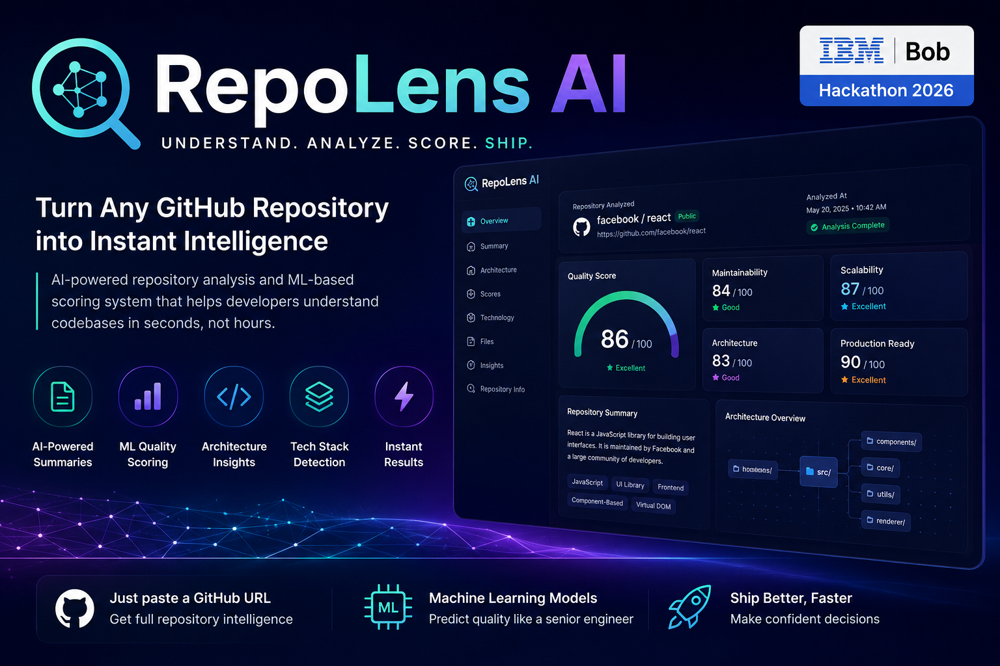

# 🔍 RepoLens AI  



### Turn Any GitHub Repository into Instant Intelligence

> AI + Machine Learning system that reads, understands, and evaluates entire codebases in seconds.

---

## 🏆 IBM Bob Hackathon 2026 Submission
**Theme:** Turn idea into impact faster  
**Type:** AI Developer Productivity Tool  
**Stack:** Next.js • FastAPI • XGBoost • GitPython • Scikit-learn

---

## 🚀 Live Demo
- Frontend: [https://repolens-delta.vercel.app/](https://repolens-delta.vercel.app/)
- Backend: [ibm-bob-hackaton-production.up.railway.app](https://ibm-bob-hackaton-production.up.railway.app/)
- GitHub: [https://github.com/ponskigila-hub/IBM-BOB-Hackaton  ](https://github.com/ponskigila-hub/IBM-BOB-Hackaton/)
(If analysis failed to catch, because it is loading the ML models. So wait around 5-10 minutes)

---

# ⚡ Problem

Developers spend too much time understanding repositories:

- Large unfamiliar codebases
- Missing documentation
- Slow onboarding
- No quality metrics
- Hidden architecture complexity

---

# 💡 Solution

RepoLens AI acts as an AI software architect that:

- Clones GitHub repositories
- Analyzes full code structure
- Extracts features using ML
- Generates human-readable insights
- Produces quality scores

---

# 🔥 Features

## Repository Intelligence
- Project purpose detection
- Folder structure analysis
- Tech stack detection
- Key file identification

## AI Explanation Engine
- Plain English repo summary
- Architecture breakdown
- Onboarding guide generation

## ML Scoring System
- Overall Quality Score
- Maintainability Score
- Scalability Score
- Architecture Score
- Production Readiness Score

---

# 🧠 Machine Learning Approach

## Models
- XGBoost Regressor
- Random Forest Regressor

## Features
- Stars, forks
- File & folder structure
- Codebase size
- Language distribution
- Commit activity
- README quality
- Dependency complexity

---

# 📂 Dataset

Kaggle dataset:
https://www.kaggle.com/datasets/donbarbos/github-repos

---

# 🏗️ System Architecture

GitHub URL  
→ Repo Cloner (GitPython)  
→ Feature Extraction  
→ ML Models (XGBoost / RF)  
→ AI Insight Generator  
→ Frontend Dashboard  

---

# 📊 Output

## Repository Summary
- What project does
- Purpose & usage

## Architecture
- Structure breakdown
- Module explanation

## ML Scores
- Quality score (0–100)
- Maintainability
- Scalability
- Production readiness

---

# 🚀 Deployment

## Frontend (Vercel)
- Root directory: frontend
- Add environment variables
- Deploy

## Backend (Fly.io / Railway)

```bash
fly launch
fly deploy
